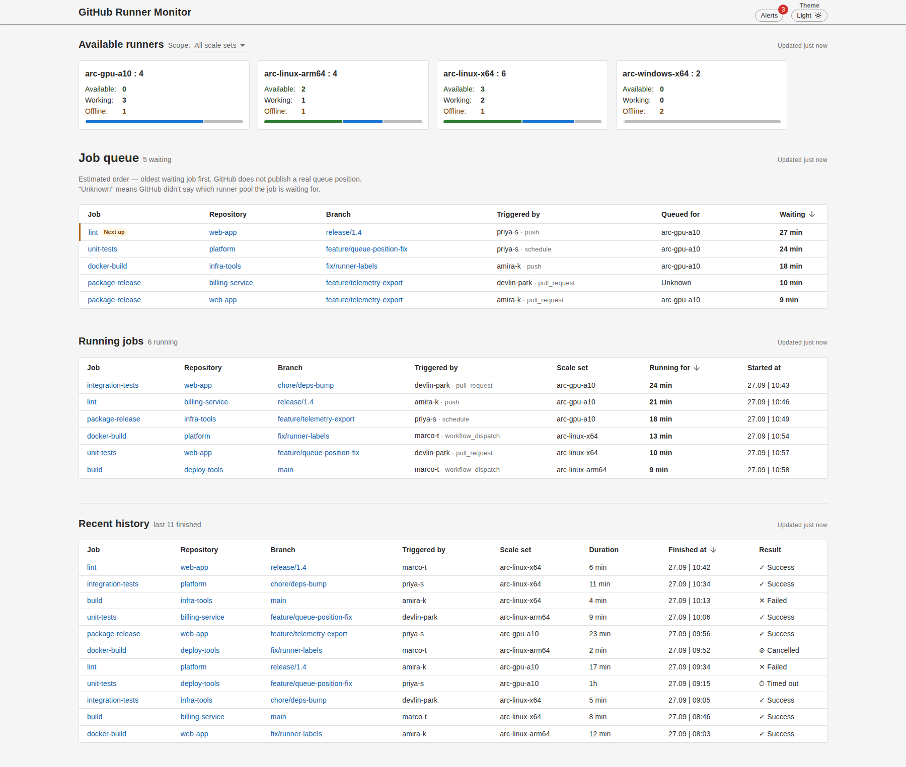
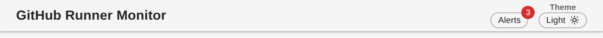

# GitHub Runner Monitor

A live dashboard for self-hosted GitHub Actions runners. It shows how many runners are free, busy or offline in each pool, which jobs are waiting and in what order, what is running now, and what finished recently. Every job links out to GitHub for the full detail.

<details open>
<summary>Table of Contents</summary>

- [Run it](#run-it)
- [What it shows](#what-it-shows)
- [Using real GitHub data](#using-real-github-data)
- [Configuration](#configuration)
- [The API](#the-api)
- [Tests](#tests)

</details>



The top of the page, with the scale set picker and the theme switch:



The repositories and people in these pictures are made up. That is the fake data the app starts with.

## Run it

You need Docker. You do not need a GitHub token, and you do not need Node installed — everything runs in containers.

From the project folder:

```bash
docker compose -f docker/docker-compose.yml up --build -d
```

Open **http://localhost:8080**.

It starts with made-up data, so it works straight away. One runner pool is deliberately full with jobs backed up behind it, so the queue has something to show.

To stop it:

```bash
docker compose -f docker/docker-compose.yml down
```

To point it at a real organisation, copy `.env.example` to `.env` and fill it in. `.env` is ignored by git, so your token cannot be committed by accident. Docker Compose reads that file and passes the values into the backend container. Every name in it is explained in [Configuration](#configuration); you can leave the whole file alone while you are on made-up data.

To run it on Kubernetes instead, see [helm/README.md](helm/README.md).

## What it shows

- **Available runners** — each pool with its size, then how many are available, working, and offline.
- **Job queue** — every waiting job, longest wait first, with the pool each is waiting for. Jobs GitHub named no pool for say "Unknown". GitHub does not publish a real queue position, so this order is worked out from when each job was created. The page says so.
- **Running jobs** — what is on a runner at this moment and for how long.
- **Recent history** — finished jobs with pass or fail, and the time each one finished, as supporting detail.

A job that ran on one of GitHub's own cloud runners, rather than a self-hosted one, shows its pool as "GitHub Actions (cloud)".

Every job shows its repository and its branch in their own columns, who started it, and what triggered it, so you can find your own row among jobs that otherwise look identical. The organisation name is left off the repository — every repository on the page belongs to the same one. The job name, the repository and the branch each link out to github.com in a new tab. A job whose branch GitHub did not report says "unknown" instead, with nothing to click.

Click any column heading to sort the table by that column, and click it again to reverse it. Sorting only reorders rows — nothing is hidden.

The job queue and running jobs tables show 10 rows at a time and recent history shows 20, with previous/next arrows underneath and a "Show all" button that lists every row on one page instead.

The job tables refresh themselves every 15 seconds and the Available runners panel every 30 seconds, and again whenever you switch back to its browser tab after being away. There is no manual refresh button — each section says on its own heading line how old its data is, so you can see whether it is current.

The page shows the numbers and leaves the reading of them to you. It does not add sentences explaining what the numbers mean. There is no log view.

## Using real GitHub data

Fake data is on by default. To point it at a real organisation, set four things before starting:

```bash
export USE_MOCK_DATA=false
export GITHUB_TOKEN=your_token_here
export GITHUB_ORGANIZATION=your_org_name
export GITHUB_WEBHOOK_SECRET=a_long_random_string

docker compose -f docker/docker-compose.yml up --build -d
```

Job data is not fetched from GitHub. GitHub posts it to this app as jobs start, run, and finish, so the organisation also needs a webhook pointing here — see below. The token is still needed, for the runner pool counts (how many runners each pool has, and how many are free) and for looking up who triggered a job and what event started it.

### What the token needs

A **fine-grained personal access token**, with the organisation itself chosen as the **resource owner** — not your own account. The self-hosted runner permission below only appears once you pick the organisation, which is the usual reason people cannot find it.

Three permissions, **all Read-only**. Nothing needs write access:

| Where in the token page | Permission | Level |
|---|---|---|
| Organization permissions | Self-hosted runners | Read-only |
| Repository permissions | Actions | Read-only |
| Repository permissions | Metadata | Read-only (GitHub selects it for you) |

Under **Repository access**, pick the repositories whose jobs you want to see, or all of them.

This is the exact set that was proved against a real organisation and it works. The application never writes anything to GitHub.

### The webhook

Where the job data comes from. Without it the queue, running and history
sections stay empty however good the token is.

Someone who owns the organisation has to do this once:

1. Make up a long random string. This is the shared secret. It is the same
   value as `GITHUB_WEBHOOK_SECRET` above, so keep it.
2. Go to **Settings → Webhooks → Add webhook** on the organisation.
3. **Payload URL**: your address plus `/api/webhooks/github`, for example
   `https://runners.example.com/api/webhooks/github`.
4. **Content type**: `application/json`.
5. **Secret**: the string from step 1.
6. **SSL verification**: leave it enabled.
7. **Which events?** Choose *Let me select individual events*, untick
   everything, and tick only **Workflow jobs**.
8. Leave **Active** ticked and press **Add webhook**.

The webhook page then shows a **Recent Deliveries** tab. Green ticks mean
messages are arriving and being accepted.

Two things worth knowing about how this behaves:

- **The backend keeps jobs in memory, not in a database.** If it restarts, whatever it held is gone unless it was saved — hence `JOB_STATE_S3_BUCKET`. With a bucket configured, the job list is written out there periodically and read back on the next start. Without one, a restart starts the page empty and it fills up again as new jobs run.
- **GitHub never re-sends a message it delivered successfully**, and **the webhook address has to be reachable from GitHub**, which posts from its own addresses. The signature on each message, not the network, is what proves a message is genuine — the backend refuses anything unsigned or wrongly signed, and refuses everything if no secret is configured.

## Configuration

### Backend

Every setting below is an environment variable read by the backend container. The four above (`USE_MOCK_DATA`, `GITHUB_TOKEN`, `GITHUB_ORGANIZATION`, `GITHUB_WEBHOOK_SECRET`) are the ones you normally touch; the rest have working defaults and are there for tuning against a large or rate-limited organisation.

| Variable | Default | What it does |
|---|---|---|
| `USE_MOCK_DATA` | `true` | `true` serves made-up data and needs no token. Set to `false` for a real organisation. |
| `GITHUB_TOKEN` | empty | The fine-grained token described above. Required when `USE_MOCK_DATA=false`. |
| `GITHUB_ORGANIZATION` | empty | The organisation to read. Required when `USE_MOCK_DATA=false`. |
| `GITHUB_WEBHOOK_SECRET` | empty | The shared secret on the organisation webhook. Every message GitHub posts is signed with it and anything that does not match is refused. With nothing set here the webhook route refuses everything, so an unconfigured deployment fails closed. Required when `USE_MOCK_DATA=false`. |
| `JOB_STATE_S3_BUCKET` | empty | Bucket the job list is saved to, so a restart does not empty the page. Leave empty and nothing is saved or read. |
| `JOB_STATE_S3_KEY` | `github-runner-monitor/job-store.json` | The object inside that bucket. |
| `JOB_STATE_SAVE_INTERVAL_SECONDS` | `60` | How often the job list is written out. Nothing is written when nothing has changed. |
| `AWS_REGION` | `us-east-2` | Region of the S3 bucket above. |
| `JOB_STORE_MAX_JOBS` | `5000` | Most jobs held in memory at once. |
| `JOB_STORE_MAX_AGE_DAYS` | `7` | How old a finished job may be and still show up under "recent history". |
| `JOB_STORE_STUCK_HOURS` | `12` | A job still showing as queued or running this long after it started is assumed to have had its "finished" message lost, and stops being shown as live. |
| `JOB_STORE_WARMUP_SECONDS` | `300` | After a restart that restored nothing, how long the page keeps saying some jobs may be missing. |
| `HISTORY_DEFAULT_LIMIT` | `200` | How many rows of finished-job history the API returns when a request does not ask for a specific amount. |
| `HISTORY_MAX_LIMIT` | `200` | The most history rows a request can ask for. |
| `RUNNING_MAX_ITEMS` | `200` | The most currently-running jobs the API returns. |
| `WEBHOOK_BODY_LIMIT` | `5mb` | Largest webhook message accepted. A finished job carries its whole step list and is routinely tens of kilobytes, well over Express's 100kb default. |
| `WEBHOOK_DEDUPE_SIZE` | `5000` | How many delivery ids are remembered, so a message GitHub re-sends is applied once. |
| `RUN_EXTRAS_CACHE_SIZE` | `2000` | How many workflow runs the backend remembers the event and triggering user for. |
| `RUN_EXTRAS_CONCURRENCY` | `4` | How many of those run lookups may be in flight at once. |
| `SHUTDOWN_DRAIN_SECONDS` | `5` | How long the backend keeps answering after being asked to stop, so messages already on their way are not lost. |
| `SHUTDOWN_DEADLINE_SECONDS` | `15` | How long shutdown is allowed to take in total before the backend exits anyway. |
| `GITHUB_MAX_RUNNER_PAGES` | `20` | Page limit when listing runners. A page is 100 runners. |
| `GITHUB_MAX_JOB_PAGES` | `10` | Page limit when listing the jobs of one run. |
| `GITHUB_MAX_RETRIES` | `3` | Retries for a failed GitHub request. |
| `GITHUB_BASE_DELAY_SECONDS` | `1` | First wait before a retry; it grows from there. |
| `GITHUB_MAX_DELAY_SECONDS` | `10` | Longest wait between retries. |
| `GITHUB_MAX_RETRY_WAIT_SECONDS` | `10` | Longest the app will honour a GitHub "retry after" instruction before giving up. |
| `GITHUB_RATE_LIMIT_RESERVE` | `50` | Requests kept in hand, so the app stops before it exhausts your rate limit. |
| `GITHUB_ETAG_CACHE_SIZE` | `500` | How many GitHub responses are remembered so an unchanged one can be skipped instead of re-fetched. |
| `CIRCUIT_BREAKER_FAILURE_THRESHOLD` | `5` | Failures in a row before the app stops calling GitHub for a while. |
| `CIRCUIT_BREAKER_TIMEOUT_SECONDS` | `60` | How long it stays stopped. |
| `CIRCUIT_BREAKER_HALF_OPEN_MAX_CALLS` | `3` | Test calls it makes before deciding GitHub is healthy again. |
| `CACHE_TTL_RUNNERS_SECONDS` | `30` | How long the runner list is kept before asking GitHub again, in seconds. One call returns up to 100 runners. |
| `CACHE_MAX_SIZE` | `100` | Most items held in the cache. |
| `REQUEST_BATCH_WINDOW_MS` | `100` | How long identical requests are gathered together before one is sent. |
| `MAX_BATCH_SIZE` | `10` | Most requests gathered into one batch. |
| `PORT` | `3001` | The backend port inside the container network. It is not published outside Docker. |

### Frontend

The frontend is a static site, so its settings are not read at build time — they are written into a small `config.js` file every time the container starts, from these environment variables. That means they can be changed from Helm values (or plain `docker run -e`) without rebuilding the image.

| Variable | Default | What it does |
|---|---|---|
| `APP_HEADING` | `GitHub Runner Monitor` | The title shown at the top of the page. |
| `APP_TAB_TITLE` | `Runner Monitor` | The browser tab title. |
| `APP_HISTORY_LIMIT` | `200` | How many rows of recent history the page asks the backend for. |
| `APP_HISTORY_PAGE_SIZE` | `20` | Rows per page in the Recent history table. |
| `APP_QUEUE_PAGE_SIZE` | `10` | Rows per page in the Job queue table. |
| `APP_QUEUE_MAX_ITEMS` | `200` | Most queued jobs the page will list. |
| `APP_RUNNING_PAGE_SIZE` | `10` | Rows per page in the Running jobs table. |
| `APP_RUNNERS_REFRESH_SECONDS` | `30` | How often the Available runners panel asks the backend again, in seconds. |

`docker/docker-compose.yml` only wires `APP_HEADING` and `APP_TAB_TITLE` through by default; the rest can still be set on the frontend container directly, or from the Helm chart.

## The API

The browser only ever calls paths starting with `/api`. Nginx passes them to the backend and removes the `/api` part, so `/api/runners` arrives as `/runners`.

| Address | What it returns |
|---|---|
| `GET /api/runners` | Every runner, tagged with its pool |
| `GET /api/scale-sets` | Each pool with its total, free, busy, and offline counts (the page shows `free` as "available") |
| `GET /api/jobs/queue` | Waiting jobs in the order they will run |
| `GET /api/jobs/running` | Jobs on a runner now, longest first |
| `GET /api/jobs/history` | Recent finished jobs with their result |
| `GET /api/settings` | The runner refresh rate the Available runners heading prints, taken from `CACHE_TTL_RUNNERS_SECONDS` |
| `POST /api/webhooks/github` | Where GitHub posts job events. Not for browser use — see [The webhook](#the-webhook). |

`/api/jobs/queue`, `/api/jobs/running`, `/api/jobs/history`, `/api/runners` and `/api/scale-sets` all accept `?scaleSet=<id>` to narrow the results to a single pool. `/api/jobs/history` also accepts `?limit=<n>`, capped by `HISTORY_MAX_LIMIT`.

```bash
curl http://localhost:8080/api/jobs/queue
```

## Tests

Backend:

```bash
cd code/backend
npm ci
npm test
```

Frontend (`npm test` starts Vitest in watch mode and never exits, so use `vitest run` instead):

```bash
cd code/frontend
npm ci
npx vitest run
```
